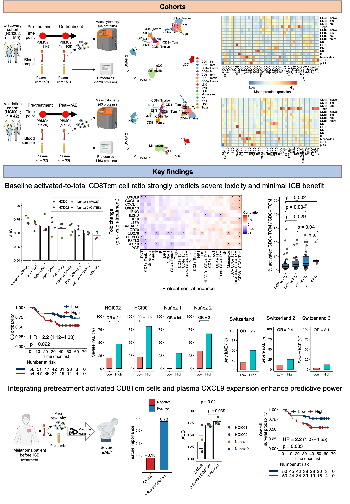

## Melanoma_irAE

This repository contains scripts to reproduce the analyses presented in the paper titled "Pre-existing peripheral CD8⁺ central memory T cell activation predicts severe toxicity and limited benefit from immune checkpoint blockade in melanoma" by Chang et al.

<b>Summary:</b> Immune-related adverse events (irAEs) represent a major clinical challenge limiting the broader application of immune checkpoint blockade (ICB) therapy. While irAEs often correlate with improved therapeutic response to ICB therapy, creating a therapeutic dilemma, many patients experience severe toxicity without corresponding clinical benefit. Existing irAE predictors frequently correlate with treatment efficacy, complicating clinical decision-making. Here, we identify blood biomarkers capable of identifying melanoma patients at high risk for severe toxicity with limited potential for clinical benefit. Comprehensive profiling of hundreds of immune cell subsets and thousands of plasma proteins in two melanoma patient cohorts revealed that the pretreatment abundance of activated (i.e., CD38⁺, HLA-DR⁺, or Ki67⁺) CD8⁺ T central memory (CD8Tcm) cells robustly predicts severe irAEs. Patients with >4% activated-to-total CD8Tcm cells demonstrated two-fold or higher odds of developing severe irAEs across six independent clinical cohorts. Integration with pretreatment plasma CXCL9 levels further enhanced predictive performance. Critically, these pretreatment biomarkers not only outperform existing irAE predictors but also uniquely identify patients at higher risk for toxicity who are less likely to derive clinical benefit. Our findings reveal blood-based biomarkers with direct clinical utility for guiding immunotherapy decisions by flagging patients who face high toxicity risk yet derive limited therapeutic benefit from checkpoint inhibitors.

  

<b>Figure 1. Overview of this work</b>. <b>A</b>. Data. <b>B</b>. Key findings.

## Scripts

The enclosed scripts are organized to reproduce all results presented in the original paper, including five main figures and six supplementary figures. 

| Script   | Corresponding Figures |
|----------|------------------------|
| 01.Rmd   | Fig. 1A–E, SFig. 1A–B |
| 02.Rmd   | Fig. 2A–J, Fig. 4A–C,G, SFig. 2A–B, SFig. 3A–B, SFig. 5A–G, STable 6 |
| 03.Rmd   | Fig. 1F–G, Fig. 3F, SFig. 1C–D, SFig. 5H |
| 04.Rmd   | Fig. 3A–E,G–J, SFig. 4A–H |
| 05.Rmd   | Fig. 4D–F |
| 06.Rmd   | Fig. 5B–E, SFig. 6A–H |
| 07.Rmd   | Fig. 3K–N |

## Citation
Tian-Gen Chang, Magdalena Kovacsovics-Bankowski, Monika Stalpes, Qin Zhou, Fernando Pablo Canale, Julia M. Martínez Gómez, Fiamma Berner, Ekaterina Friebel, Lucia Boffelli, Amos Stemmer, Li-Chun Cheng, Ramji Srinivasan, Matt Spitzer, Chi-Ping Day, Mitchell Paul Levesque, Burkhard Becher, Lukas Flatz, Muhammad Zaki Hidayatullah Fadlullah, Alyssa Erickson-Wayman, Hannah Maciejewski, Marcus Monroe, Elliot A. Asare, Vinay Mathew Thomas, Aik Choon Tan, Jordan P. McPherson, Nicolás Gonzalo Nuñez, Eytan Ruppin, Siwen Hu-Lieskovan. *Pre-existing peripheral CD8⁺ central memory T cell activation predicts severe toxicity and limited benefit from immune checkpoint blockade in melanoma.* (under review)

## Related links

## Contact
Dr. Eytan Ruppin: <eytan.ruppin@nih.gov>; [Lab page](https://ccr.cancer.gov/staff-directory/eytan-ruppin/). 

Dr. Siwen Hu-Lieskovan: <siwen.hu-lieskovan@hci.utah.edu>; [Homepage](https://healthcare.utah.edu/find-a-doctor/siwen-hu-lieskovan). 
.

Dr. Nicolás Gonzalo Nuñez: <nicolas.nunez@unc.edu.ar>; [Homepage](https://bicyt.conicet.gov.ar/fichas/p/en/nicolas-gonzalo-nunez). 

Dr. Tian-Gen Chang: <tiangen.chang@nih.gov>; [Google scholar](https://scholar.google.com/citations?user=9PM5gWIAAAAJ&hl=en/). 
