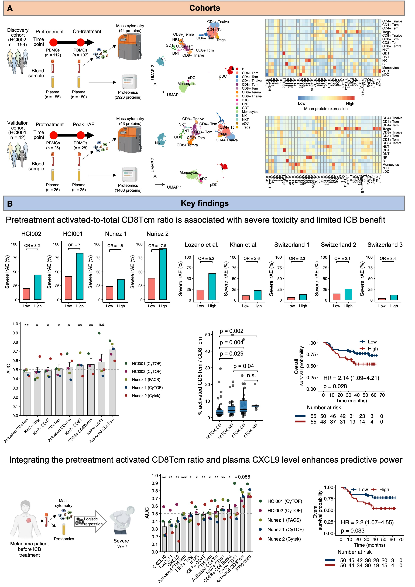

## Melanoma_irAE

This repository contains scripts to reproduce the analyses presented in the paper titled "Pre-existing peripheral CD8⁺ central memory T cell activation predicts severe toxicity and is associated with inferior outcomes in melanoma patients receiving immune checkpoint blockade" by Chang et al.

<b>Summary:</b> Immune-related adverse events (irAEs) represent a major clinical challenge during immune checkpoint blockade (ICB). Although irAEs have been associated with favorable outcomes following ICB, some patients experience severe toxicity together with poor clinical outcomes, highlighting the need for biomarkers that identify patients at risk of severe toxicity and characterize their clinical outcomes. Here, we identify peripheral blood biomarkers associated with an increased risk of severe irAEs and poorer clinical outcomes among melanoma patients receiving ICB. Comprehensive profiling of 626 peripheral immune cell subsets and 2,926 plasma proteins in 159 treatment courses identified the pretreatment activated (i.e., CD38⁺, HLA-DR⁺, or Ki67⁺) CD8⁺ central memory T (CD8Tcm) cells as a candidate predicting severe irAEs. A higher activated-to-total CD8Tcm ratio was associated with higher odds of severe irAEs across multiple independent, multi-institutional clinical cohorts and across both the clinically actionable and conventional Common Terminology Criteria for Adverse Events (CTCAE) grade ≥3 severe irAE definitions. A two-variable logistic regression model integrating pretreatment activated CD8Tcm ratio with plasma CXCL9 level further improved discrimination across independent cohorts and outperformed existing pretreatment irAE predictors evaluated. These pretreatment biomarkers identified a subset of patients who are at increased risk of severe toxicity and also experience inferior outcomes from ICB. Taken together, these findings uncover blood-based biomarker candidates that could be used to stratify patients according to pretreatment risk of severe irAEs.

  

<b>Figure 1. Overview of this work</b>. <b>A</b>. Data. <b>B</b>. Key findings.

## Scripts

The enclosed scripts are organized to reproduce figures presented in the original paper. 

| Script   | Corresponding Figures |
|----------|------------------------|
| 01.Rmd   | Fig. 1A-E, SFig. 4A-B |
| 02.Rmd   | Fig. 2, Fig. 4A,B, SFig. 5A-D, SFig. 10A-G, STable 8 |
| 03.Rmd   | Fig. 3A,B,D-H, SFig.4C,D, SFig. 6A-E, SFig. 7, SFig. 8, SFig. 9B,C,  SFig. 10H,  SFig. 14A,  SFig. 16A |
| 04.Rmd   | Fig. 4C-E,G, SFig. 14B, SFig. 16B, STable 3 |
| 05.Rmd   | Fig. 3C, I-K, Fig. 4F, Fig. 5B-F, SFig. 9A, SFig. 11, SFig. 12, SFig. 13, SFig. 14A,B,C, SFig. 15, SFig. 16C, SFig. 17, STables 9-11 |

## Citation
Tian-Gen Chang, Magdalena Kovacsovics-Bankowski, Monika Stalpes, Qin Zhou, Fernando Pablo Canale, Julia M. Martínez Gómez, Fiamma Berner, Ekaterina Friebel, Lucia Boffelli, Amos Stemmer, Li-Chun Cheng, Ramji Srinivasan, Matthew H. Spitzer, Chi-Ping Day, Mitchell Paul Levesque, Burkhard Becher, Lukas Flatz, Lynda Chin, Muhammad Zaki Hidayatullah Fadlullah, Alyssa Erickson-Wayman, Hannah Maciejewski, Marcus Monroe, Elliot A. Asare, Vinay Mathew Thomas, Aik Choon Tan, Jordan P. McPherson, Nicolás Gonzalo Nuñez, Eytan Ruppin, Siwen Hu-Lieskovan. *Pre-existing peripheral CD8⁺ central memory T cell activation predicts severe toxicity and is associated with inferior outcomes in melanoma patients receiving immune checkpoint blockade.*

## Related links
[Source data](https://doi.org/10.7910/DVN/Z6NJPG)

## Contact
Dr. Tian-Gen Chang: <tiangen.chang@sjtu.edu.cn>; [Lab page](https://rootchang.github.io/AISI_Lab/). 

Dr. Nicolás Gonzalo Nuñez: <nicolas.nunez@unc.edu.ar>; [Homepage](https://bicyt.conicet.gov.ar/fichas/p/en/nicolas-gonzalo-nunez). 

Dr. Eytan Ruppin: <eytan.ruppin@nih.gov>; [Homepage](https://researchers.cedars-sinai.edu/Eytan.Ruppin). 

Dr. Siwen Hu-Lieskovan: <siwen.hu-lieskovan@hci.utah.edu>; [Homepage](https://healthcare.utah.edu/find-a-doctor/siwen-hu-lieskovan). 